<div align="center">


[](https://power-fitness-gym.vercel.app)
[](http://gymmanagementsystem54.runasp.net/swagger)
[](https://www.linkedin.com/in/fady-kaiser/)


**A real gym, end to end:** a public website, an admin dashboard for the front desk,<br/>
a portal for trainers and a portal for members — in English and Arabic (RTL), light and dark.

</div>

---

## 🚀 Try it in 10 seconds

Open the **[live demo](https://power-fitness-gym.vercel.app/login)** and click one of the one-click demo buttons on the login page,
or sign in manually:

| Role | Email | Password | What you will see |
|---|---|---|---|
| **Admin** | `admin@demo.gym` | `Demo@Gym2026` | Dashboard, members, memberships, payments, classes, check-in desk |
| **Trainer** | `trainer@demo.gym` | `Demo@Gym2026` | Today's classes, rosters, attendance, class history |
| **Member** | `member@demo.gym` | `Demo@Gym2026` | Membership card, QR check-in code, class booking, payments |

The demo database is seeded with ~3 months of realistic activity (40 members, 6 trainers, 240 classes, 1,400+ bookings, 1,000+ check-ins), so every chart has something to show.

> [!NOTE]
> The API runs on a free hosting plan, so the very first request after a quiet period can take a few seconds while the server wakes up.

---

## 📸 Screenshots

<table>
  <tr>
    <td width="50%">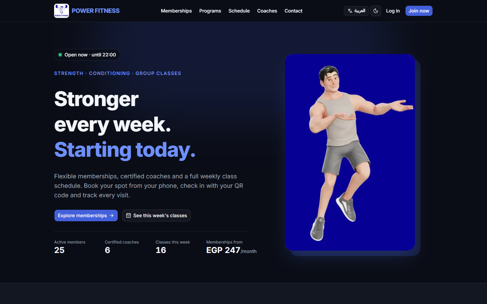<p align="center"><b>Landing page</b> — live stats, open/closed badge from opening hours</p></td>
    <td width="50%">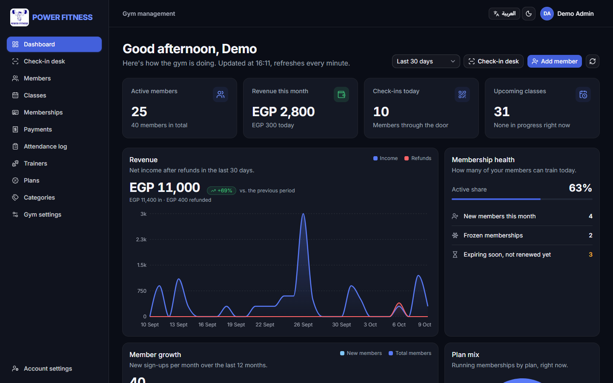<p align="center"><b>Admin dashboard</b> — KPIs, revenue, growth and plan mix</p></td>
  </tr>
  <tr>
    <td>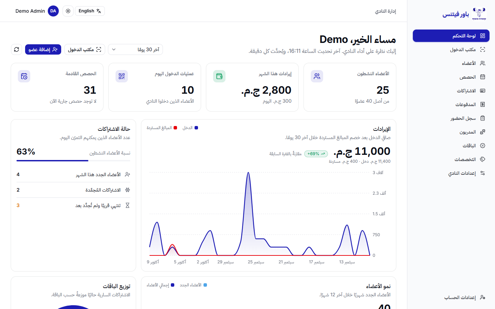<p align="center"><b>Full Arabic / RTL support</b> — UI translated, data kept as typed</p></td>
    <td>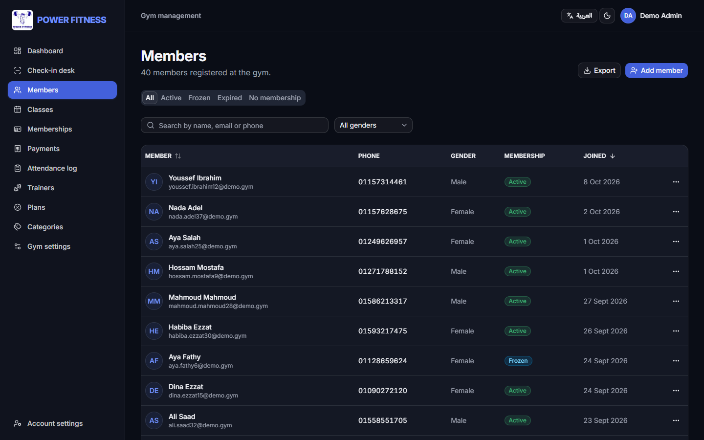<p align="center"><b>Members</b> — server-side search, filters, paging and Excel export</p></td>
  </tr>
  <tr>
    <td>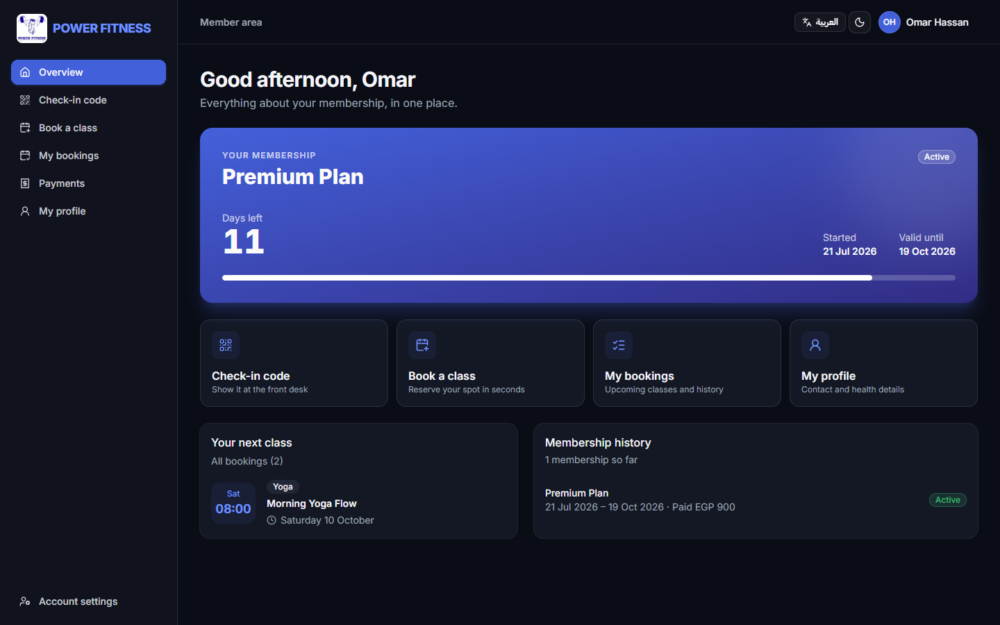<p align="center"><b>Member portal</b> — membership card, next class, history</p></td>
    <td>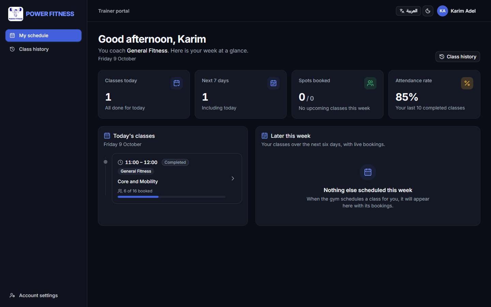<p align="center"><b>Trainer portal</b> — today's classes, bookings, attendance rate</p></td>
  </tr>
  <tr>
    <td>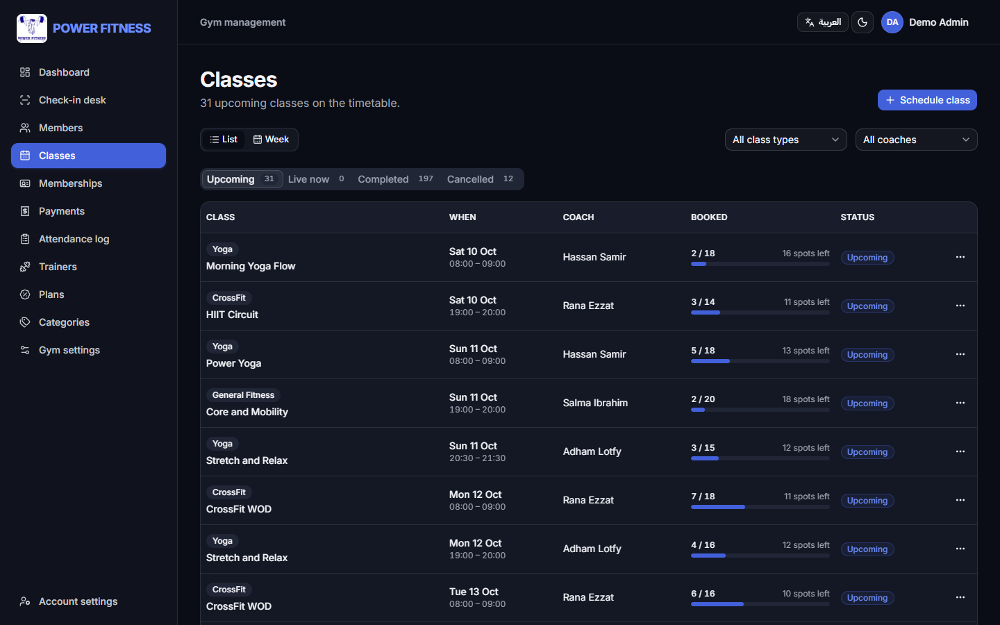<p align="center"><b>Classes</b> — capacity, trainer clash and category rules</p></td>
    <td>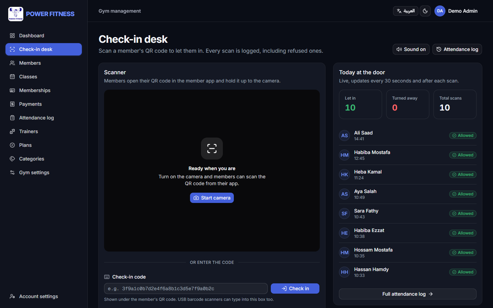<p align="center"><b>Check-in desk</b> — scan the member's QR code with the camera</p></td>
  </tr>
</table>

<p align="center">
  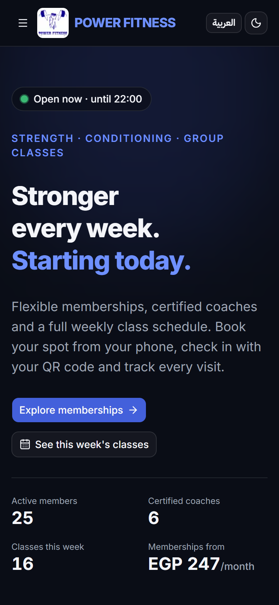
  &nbsp;&nbsp;
  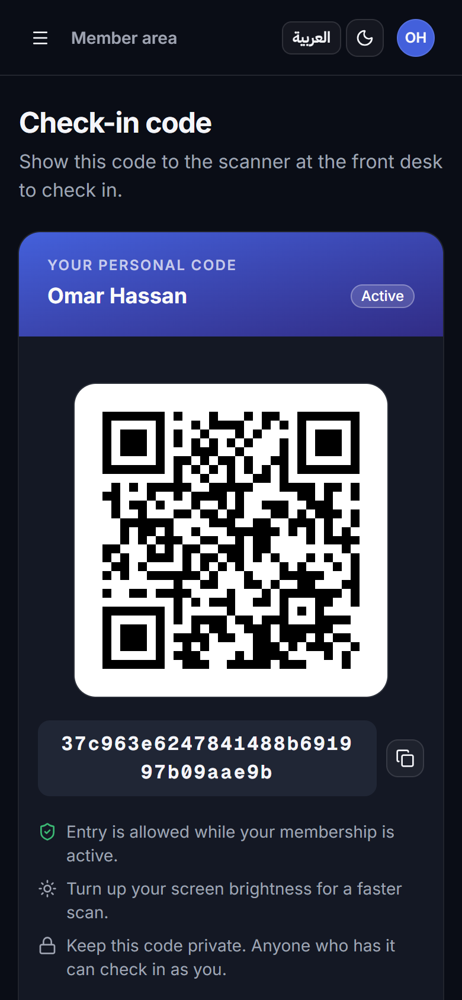
  &nbsp;&nbsp;
  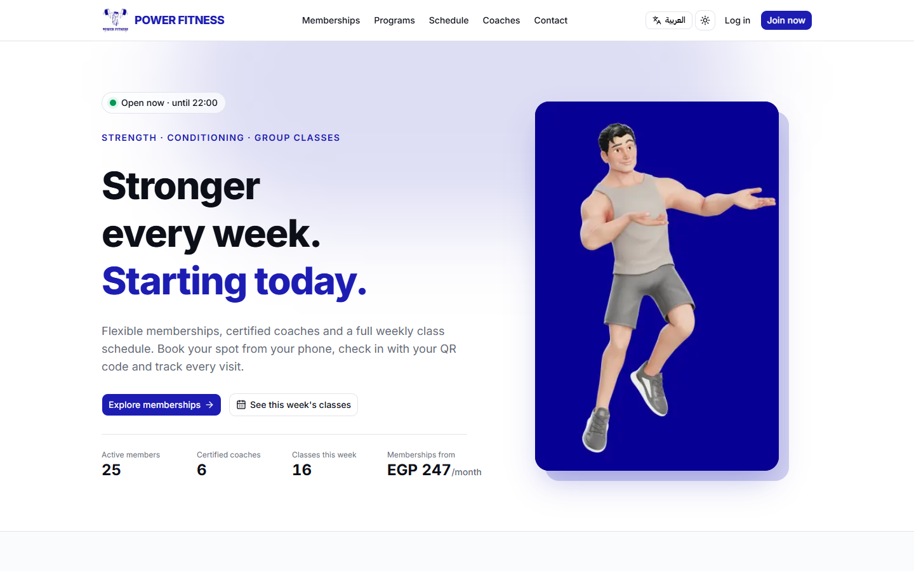
</p>

---

## ✨ Features

<details open>
<summary><b>🌐 Public website (no login)</b></summary>

- Landing page rendered on the server and cached with Next.js 16 **Cache Components** (`"use cache"`): instant load, refreshed in the background about once a minute.
- Live numbers (active members, coaches, classes this week, "from EGP X / month"), plans, programs, weekly schedule, coaches and contact details — all from the database.
- "Open now · until 22:00" badge computed from the gym's opening hours in the gym's time zone (Africa/Cairo).
- Self sign-up for new members; SEO metadata, sitemap and Open Graph previews.
</details>

<details>
<summary><b>🛠️ Admin (front desk & management)</b></summary>

- **Dashboard:** KPIs and charts (revenue vs refunds, member growth, plan mix, check-ins), with period comparison.
- **Members:** multi-step create wizard, profile photo upload, health record, online-account invitation by email.
- **Memberships:** sell, renew (queued after the current one), freeze / unfreeze (limits per membership), cancel with partial refund.
- **Payments:** every purchase, renewal and refund with method and the staff member who received it.
- **Classes:** schedule with capacity, trainer clash detection and trainer-speciality checks; cancelling a class notifies booked members by email.
- **Check-in desk:** scan a member's QR code with the camera (or type / USB-scan the code); one allowed check-in per day, refused scans logged with the reason.
- **Trainers, plans, categories, gym settings** (name, contact, map, opening hours) and **Excel exports**.
</details>

<details>
<summary><b>🏋️ Trainer portal</b></summary>

- Today's classes and the next 7 days with live bookings.
- Class roster and attendance marking; class history and attendance rate.
</details>

<details>
<summary><b>🙋 Member portal</b></summary>

- Membership card with days left; personal QR check-in code.
- Book / cancel classes (capacity, overlapping bookings and a 2-hour cancellation deadline are enforced by the API).
- Bookings, payment history and profile.
</details>

<details>
<summary><b>🔑 SuperAdmin</b></summary>

- Creates admin accounts (invite email) and enables / disables any account except another SuperAdmin.
</details>

---

## 🏗️ Architecture

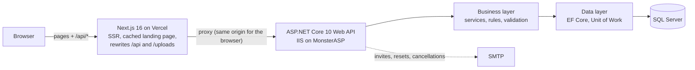

**Why a proxy?** The browser only ever talks to the Next.js origin. That keeps the refresh-token cookie first-party, removes the need for CORS, and lets the landing page fetch data on the server.

| Project | Responsibility |
|---|---|
| `GymManagementAPI` | Controllers, JWT auth & policies, rate limiting, ProblemDetails, security headers, Swagger, Serilog, health checks |
| `GymManagementBLL` | Services and business rules, DTOs, FluentValidation validators, `Result<T>` error model |
| `GymManagementDAL` | EF Core 10 entities & migrations, ASP.NET Core Identity, generic repository + Unit of Work |
| `GymManagement.Tests` | 379 xUnit integration tests against a real SQL Server (`WebApplicationFactory`) |
| `gym-web` | Next.js 16 App Router frontend (TypeScript, Tailwind CSS 4, shadcn/ui) |

---

## 🧠 Engineering highlights

**Security**
- Short-lived JWT access token (15 min) kept **in memory**; **rotating refresh token** in an `HttpOnly; Secure; SameSite=Lax` cookie, stored **hashed** in the database, with **reuse detection** (a replayed token signs out every session).
- Role-based policies (SuperAdmin / Admin / Trainer / Member) on every endpoint, guarded by an automated endpoint-security test.
- Login rate limiting per client IP (proxy-aware), account lockout after 5 failures, security headers, no server banner.
- Invite and reset links are single-use; passwords are never chosen by staff.

**Data integrity**
- Multi-table writes in one transaction (e.g. sign-up = account + member profile; sale = membership + payment).
- Plan name and price are **copied onto the membership**, so later price changes never rewrite history.
- Optimistic concurrency (`RowVersion`) on classes, soft delete with global query filters, all times stored in UTC and shown in the gym's time zone.
- 60+ machine-readable error codes (`Session.TrainerBusy`, `Booking.CancellationDeadlinePassed`, …) returned as RFC 7807 ProblemDetails and translated by the frontend.

**Frontend**
- TanStack Query for server state, Redux Toolkit for auth/UI state, React Hook Form + Zod mirroring the API validators.
- API types **generated from the OpenAPI document** (`openapi-typescript`); a snapshot test fails the build if the contract changes unexpectedly.
- **Internationalization done properly:** every UI string comes from `en` / `ar` message files, enums are stored in English and translated in the UI, user-entered data is stored once as typed (no machine translation), full RTL layout, language detected from the browser and remembered.
- Accessible components (keyboard, focus, ARIA), dark mode, responsive down to small phones.
- Lighthouse (desktop): **98–99 Performance · 100 Accessibility · 100 Best Practices · 100 SEO**.

**Quality**
- 379 backend integration tests (auth flows, every business rule, permissions, contract snapshots) + Playwright end-to-end tests.
- 0 build warnings, Conventional Commits, one branch per phase.

---

## 🧰 Tech stack

| Backend | Frontend | Tooling & hosting |
|---|---|---|
| ASP.NET Core 10 Web API | Next.js 16 (App Router, Cache Components) | xUnit + `WebApplicationFactory` |
| Entity Framework Core 10 | React 19 + TypeScript | Playwright |
| SQL Server | Tailwind CSS 4 + shadcn/ui | Swagger / OpenAPI, Postman collection |
| ASP.NET Core Identity + JWT | TanStack Query · Redux Toolkit | ESLint · Prettier |
| FluentValidation | React Hook Form + Zod | Vercel (frontend) |
| Serilog · Health checks | next-intl (EN / AR, RTL) · next-themes | MonsterASP / IIS (API + DB) |
| MailKit (SMTP) · ClosedXML (Excel) | Recharts · html5-qrcode · qrcode.react | Git (Conventional Commits) |

---

## 💻 Run it locally

**Prerequisites:** .NET 10 SDK, Node.js 20+, SQL Server (Express or Developer).

**1. API**

```bash
cd GymManagementAPI
dotnet user-secrets set "ConnectionStrings:DefaultConnection" "Server=.;Database=GymG01DB;Trusted_Connection=true;TrustServerCertificate=true"
dotnet user-secrets set "Jwt:Key" "<any random string of 32+ characters>"
dotnet user-secrets set "SuperAdmin:Password" "<your first SuperAdmin password>"
dotnet user-secrets set "DemoData:Password" "Demo@Gym2026"
cd ..
dotnet run --project GymManagementAPI -- --seed-demo        # optional: ~3 months of demo data
dotnet run --project GymManagementAPI --launch-profile https # https://localhost:7080/swagger
```

In Development the database is created and migrated automatically on startup.

**2. Frontend**

```bash
cd gym-web
npm install
npm run dev   # http://localhost:3000
```

See [`gym-web/README.md`](gym-web/README.md) for scripts and the folder structure.

**3. Tests**

```bash
dotnet test                 # backend integration tests (needs SQL Server)
cd gym-web && npm run test:e2e
```

---

## 📁 Repository layout

```
GymManagementAPI/      Web API: controllers, auth, middleware, Program.cs
GymManagementBLL/      business services, DTOs, validators
GymManagementDAL/      entities, DbContext, migrations, repositories
GymManagement.Tests/   integration tests + API contract snapshots
gym-web/               Next.js frontend
postman/               Postman collection + environment
```

---

## 🕰️ History

This project started as an **ASP.NET Core MVC** app (3-layer architecture, Identity, AutoMapper).
That version is preserved on the [`main`](https://github.com/Fady519/GymManagementSystem/tree/main) branch and the
[`v1-mvc`](https://github.com/Fady519/GymManagementSystem/tree/v1-mvc) tag.
Version 2 rebuilt it as a REST API + Next.js application, phase by phase (`phase/*` branches), keeping the same domain.

---

<div align="center">

Built by **[Fady Kaiser](https://www.linkedin.com/in/fady-kaiser/)** — Full Stack .NET Developer


</div>
